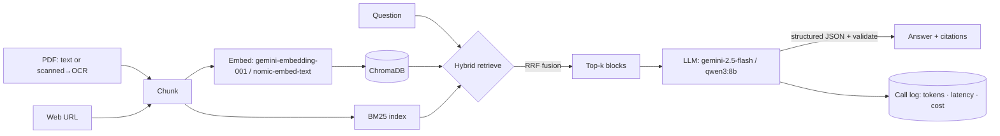

# 📄 DocChat — Chat with your PDFs (Advanced RAG)

Ask questions about your documents and get **grounded answers with citations**. DocChat uses
**hybrid retrieval** (BM25 keyword search + dense embeddings, fused with Reciprocal Rank Fusion),
returns **schema-validated** answers, and **logs the cost/latency of every LLM call**.

Feed it **text PDFs, scanned PDFs (auto-OCR'd), or web page URLs**. Runs on **Google Gemini** (paste your free key) or **fully local with Ollama** — no key, no data leaves your machine.

<!-- Add after deploying: [](YOUR_STREAMLIT_URL) -->
 

> **Demo:** run `streamlit run app.py` and add a screenshot/GIF here.

---

## Why it's interesting

Most "chat with PDF" demos do naive top-k vector search and `json.loads()` the model's raw text.
DocChat is built the way a production RAG service should be:

- **Multi-source ingestion** — text PDFs, **scanned PDFs** (Tesseract OCR fallback per page), and **web
  URLs** (main-text extraction with boilerplate stripped) — all normalized to the same chunk pipeline.
- **On-demand vision** — optionally send the cited PDF page images to a multimodal model to answer
  about **figures, charts, or scanned visuals**. It's a single multimodal call, **bounded to 2 pages
  per question** so the (paid) image tokens stay opt-in. Best with Gemini; local needs a capable vision
  model (`ollama pull llava`).
- **Hybrid retrieval + RRF** — combines lexical (BM25) and semantic (embeddings in **ChromaDB**, with an
  in-memory NumPy fallback for constrained hosts) ranking, so it finds both exact-term matches and
  paraphrased meaning. RRF fuses the two without score-scale tuning.
- **Grounded, cited answers** — every answer cites the source blocks (file + page); if the context
  doesn't contain the answer, the model says so.
- **Structured output, validated** — the model returns JSON constrained by a Pydantic schema
  (Gemini `response_schema` / Ollama `format`), parsed and validated — never `json.loads()` on raw text.
- **Prompt-injection aware** — document text and the question are treated as untrusted *data*; the
  system prompt refuses instructions embedded inside them.
- **Cost & latency observability** — every LLM call is logged (model, prompt version, tokens, latency,
  USD cost) to `logs/llm_calls.jsonl`, and the per-answer cost is shown in the UI.
- **Pinned models** — exact model IDs in one config file (no `-latest` drift).

## Architecture



📖 **Full design, component breakdown, and flow diagrams: [docs/ARCHITECTURE.md](docs/ARCHITECTURE.md)**

## Quickstart

```bash
git clone https://github.com/MohammedMaksood/docchat.git
cd docchat
python -m venv .venv && source .venv/bin/activate    # Windows: .venv\Scripts\activate
pip install -r requirements.txt
streamlit run app.py
```

**Option A — Local (free, private):**
```bash
ollama pull qwen3:8b
ollama pull nomic-embed-text
```
Pick **Ollama (local)** in the sidebar, upload a PDF (or paste a URL), and ask. For **scanned** PDFs,
install Tesseract: `sudo apt install tesseract-ocr` (Linux) / `brew install tesseract` (macOS).

**Option B — Gemini (cloud):** get a free key at [aistudio.google.com/apikey](https://aistudio.google.com/apikey),
paste it in the sidebar (or copy `.env.example` → `.env`). Default model: `gemini-2.5-flash`.

## Tests

```bash
pip install pytest && pytest -q   # retrieval/chunking unit tests, no API calls
```

## Project structure

```
docchat/
├── app.py                 # Streamlit UI
├── ragcore/
│   ├── config.py          # pinned model IDs, pricing, tunables
│   ├── ingest.py          # PDF → page-aware chunks
│   ├── embeddings.py      # Gemini / Ollama embedders (batched)
│   ├── retriever.py       # hybrid BM25 + dense, RRF fusion
│   ├── prompts.py         # versioned, injection-resistant prompts
│   ├── generation.py      # structured output + validation
│   ├── obs.py             # per-call cost/latency logging
│   └── rag.py             # orchestration
└── tests/
```

## Deploy (free)

Push to GitHub → [share.streamlit.io](https://share.streamlit.io) → point at `app.py`. Users paste their
own Gemini key in the sidebar, so no secrets live in the deployment.

> If Chroma raises a SQLite-version error on Streamlit Cloud, add `pysqlite3-binary` to
> `requirements.txt` and put this at the very top of `app.py`:
> `import pysqlite3, sys; sys.modules["sqlite3"] = pysqlite3`

## Notes

- Models pinned June 2026 (Gemini 2.0 Flash was retired 2026-06-01). Swap IDs in `ragcore/config.py`.
- Local path (Ollama + `nomic-embed-text`) is verified end-to-end; the Gemini path follows the current
  `google-genai` SDK. Bring your own key to exercise it.

## License

MIT — see [LICENSE](LICENSE).
