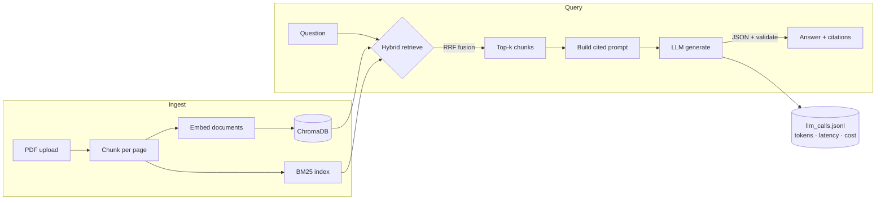
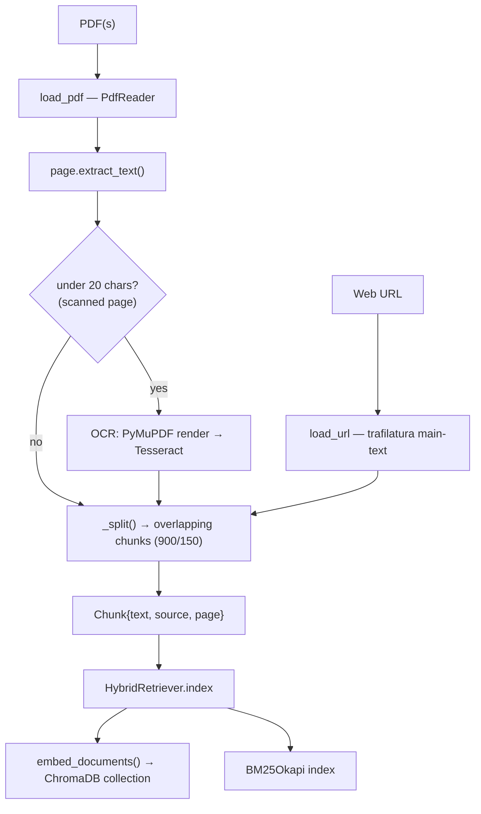
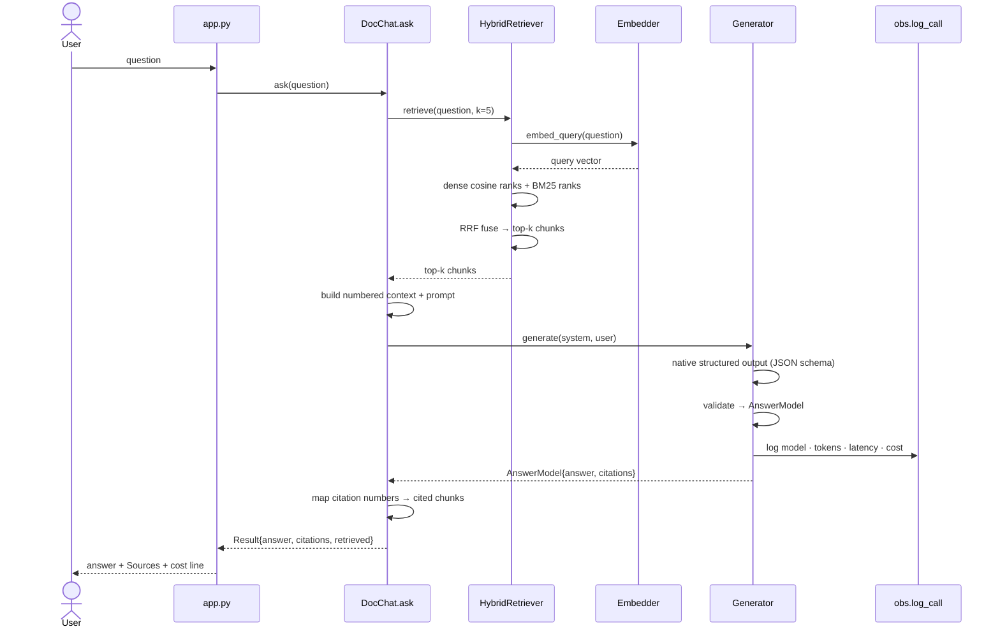

# DocChat — Architecture & How It Works

A deep-dive into how DocChat turns a pile of PDFs into grounded, cited answers.
For setup and the quick pitch, see the [README](../README.md).

---

## 1. What it does

1. You provide **sources** — text PDFs, **scanned PDFs** (OCR'd automatically), or **web URLs**. DocChat
   extracts the text and splits it into small, page-tagged chunks.
2. It builds **two indexes** over those chunks: a **keyword index** (BM25) and a **semantic index** (embeddings).
3. When you **ask a question**, it retrieves the most relevant chunks from *both* indexes and fuses the
   rankings (**Reciprocal Rank Fusion**).
4. It sends those chunks to an **LLM** with a strict prompt and gets back a **JSON answer with citations**,
   which is **validated against a schema**.
5. Every LLM call is **logged** with token counts, latency, and cost.

Two interchangeable backends: **Gemini** (cloud) or **Ollama** (fully local). The code path is identical;
only the embedder/generator objects differ.

---

## 2. High-level architecture



---

## 3. Components

Each module has one job and a small, clear interface.

| File | Responsibility | Key API |
|------|----------------|---------|
| `ragcore/config.py` | Single source of truth: pinned model IDs, pricing, retrieval tunables | constants |
| `ragcore/ingest.py` | PDFs (text + scanned→OCR) and web URLs → page-aware chunks | `load_pdf(...)`, `load_url(...)` |
| `ragcore/embeddings.py` | Turn text into vectors (Gemini or Ollama), batched | `embed_documents`, `embed_query` |
| `ragcore/retriever.py` | Hybrid BM25 + dense (ChromaDB) retrieval, fused with RRF | `HybridRetriever.index`, `.retrieve` |
| `ragcore/prompts.py` | Versioned, injection-resistant prompt text | `SYSTEM`, `USER_TEMPLATE`, `PROMPT_VERSION` |
| `ragcore/generation.py` | Structured, schema-validated LLM output + logging | `GeminiGenerator`, `OllamaGenerator` |
| `ragcore/obs.py` | One structured log record per LLM call, with cost | `log_call(...)`, `estimate_cost(...)` |
| `ragcore/vision.py` | Render a cited PDF page to a PNG for on-demand vision | `render_page_png(...)` |
| `ragcore/rag.py` | Orchestrates ingest → retrieve → answer (+ optional vision) | `DocChat.ingest`, `DocChat.ask` |
| `app.py` | Streamlit UI; wires the chosen backend | — |

**Data models**
- `Chunk(text, source, page)` — one retrievable unit, carries its file + page for citations.
- `AnswerModel(answer: str, citations: list[int])` — the validated LLM output schema.

---

## 4. App flow

### 4a. Ingestion (when you click "Build index")



Chunking happens **per page** so every chunk keeps an accurate page number for citations. A page with
little/no extractable text is treated as **scanned** and rendered + OCR'd with Tesseract; **web pages**
are fetched and reduced to main text (nav/ads stripped) before chunking. Document embeddings are
produced in **one batched call** (Gemini batches up to 100/request; Ollama sends all inputs at once) to
keep API usage low.

### 4b. Query (when you ask a question)



---

## 5. Retrieval deep-dive (the interesting part)

Naive RAG does only dense (embedding) search, which misses exact terms (names, codes, acronyms).
DocChat runs **both** retrievers and fuses them:

- **Dense**: embed the query, cosine search over a **ChromaDB** collection, take the top *pool* (20).
- **Sparse (BM25)**: classic lexical scoring over tokenized chunks, take the top *pool* (20).
- **Reciprocal Rank Fusion (RRF)**: combine the two ranked lists by *rank position*, not raw score:

  ```
  score(chunk) = Σ_retrievers  1 / (k + rank_in_that_retriever)        # k = 60
  ```

  RRF needs no score normalization between retrievers (cosine and BM25 live on different scales),
  which is exactly why it's a common production default. Final top-*k* (5) chunks go to the LLM.

See `ragcore/retriever.py`.

---

## 6. Generation: structured output, validated

The model is asked to return JSON matching `AnswerModel`. Both backends use **native structured output**:

- **Gemini** — `response_schema=AnswerModel` on the request; the SDK returns a parsed object.
- **Ollama** — `format=<JSON schema>` constrains decoding to valid JSON (`think=False` suppresses
  reasoning-model `<think>` blocks).

The result is parsed with Pydantic. A small **salvage** step extracts an embedded JSON object if the
string is wrapped in prose; if it still fails, a clear error surfaces in the UI. We rely on native
structured output rather than an expensive parse-and-re-call loop (see "Cost" below).

Citation numbers returned by the model are mapped back to the actual `Chunk` objects, so the UI can
show **file + page** for each source.

See `ragcore/generation.py` and `ragcore/prompts.py`.

---

## 6a. On-demand vision (optional)

When the user enables vision, `DocChat.ask` renders the **cited PDF pages** to PNGs
(`vision.render_page_png`) and sends them with the prompt in **one multimodal call** — not a fan-out.
Only distinct cited pages are rendered, capped at `MAX_VISION_PAGES` (2). The original PDF bytes are
kept in memory from ingest so pages can be rendered without re-uploading.

- **Gemini**: images are added as `types.Part.from_bytes(...)` in the same `generate_content` call as
  the text; structured output still applies.
- **Ollama**: the request switches to a vision model (`llava`) with base64 images.

Vision is **off by default** and only spends image tokens when toggled on. Quality scales with the
model — Gemini handles figures/charts well; tiny local models (e.g. moondream) do not, so use `llava`
or larger locally.

---

## 7. Observability & cost

Every LLM call writes one JSON line to `logs/llm_calls.jsonl` (gitignored):

```json
{"ts": 1781779551.9, "request_id": "6503cc55ae7c", "provider": "ollama",
 "model": "qwen3:8b", "prompt_version": "docchat-rag-v1",
 "input_tokens": 221, "output_tokens": 22, "latency_ms": 5092, "cost_usd": 0.0}
```

Cost is computed from `PRICING` in `config.py` (USD per 1M tokens). Local Ollama calls are $0. The
per-answer cost is also shown live in the UI. This makes spend auditable and prompt/model regressions
diagnosable.

---

## 8. Security

- **Prompt injection**: document text and the user question are untrusted *data*. The system prompt
  instructs the model to never follow instructions found inside the context or question, and to refuse
  to reveal/alter its rules. User content is never concatenated into the system instruction.
- **Secrets**: the Gemini key is read from the sidebar (password field) or `.env`, passed only to the
  SDK client — never logged and never placed in a prompt. `.gitignore` blocks `.env*` (only
  `.env.example` is committed).

---

## 9. Configuration & pinned models

All model IDs and prices live in `ragcore/config.py` — no `-latest` aliases, so behavior can't drift
silently. Verified against ai.google.dev (June 2026):

| Role | Cloud (Gemini) | Local (Ollama) |
|------|----------------|----------------|
| Chat | `gemini-2.5-flash` | `qwen3:8b` |
| Embeddings | `gemini-embedding-001` (768-dim) | `nomic-embed-text` |

> Gemini 2.0 Flash was retired 2026-06-01 and is intentionally not used.

---

## 10. Testing

`tests/test_retriever.py` covers chunking and hybrid-RRF retrieval using a stub embedder — **no API
calls, runs offline**. The local end-to-end path (PDF → embeddings → retrieval → structured answer →
log) was verified manually with Ollama.

---

## 11. Extending it

- **Persist / scale the vector store**: `HybridRetriever` uses an in-memory **ChromaDB** client. For
  durability, swap `EphemeralClient` → `PersistentClient(path=...)`; for scale, point the same
  `index/retrieve` interface at a **Qdrant** server.
- **Add a reranker**: insert a cross-encoder rerank step between RRF and the top-*k* cut.
- **More file types**: add loaders alongside `load_pdf` that return the same `Chunk` list.
